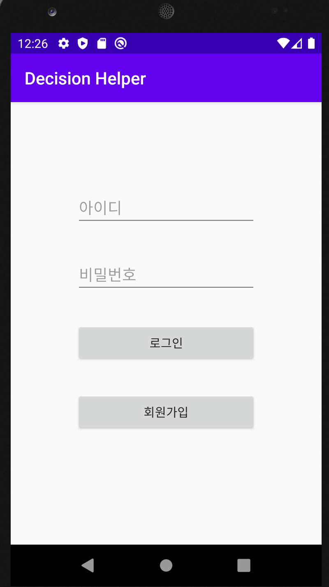
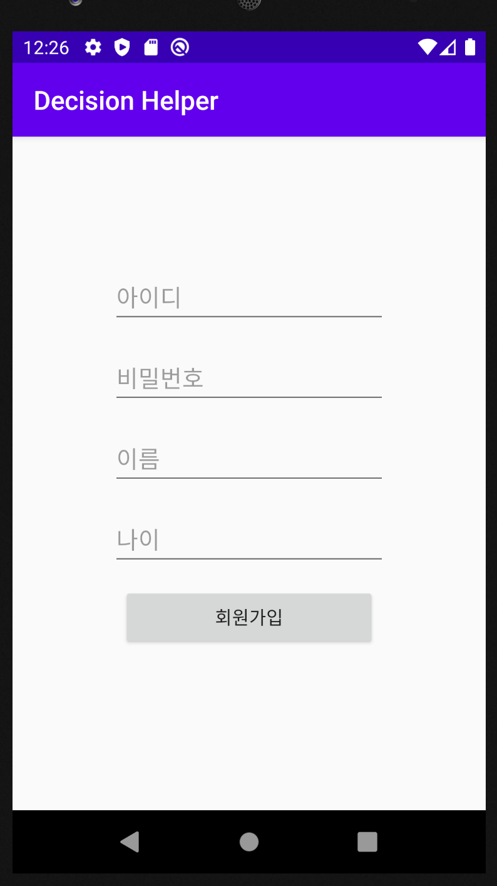
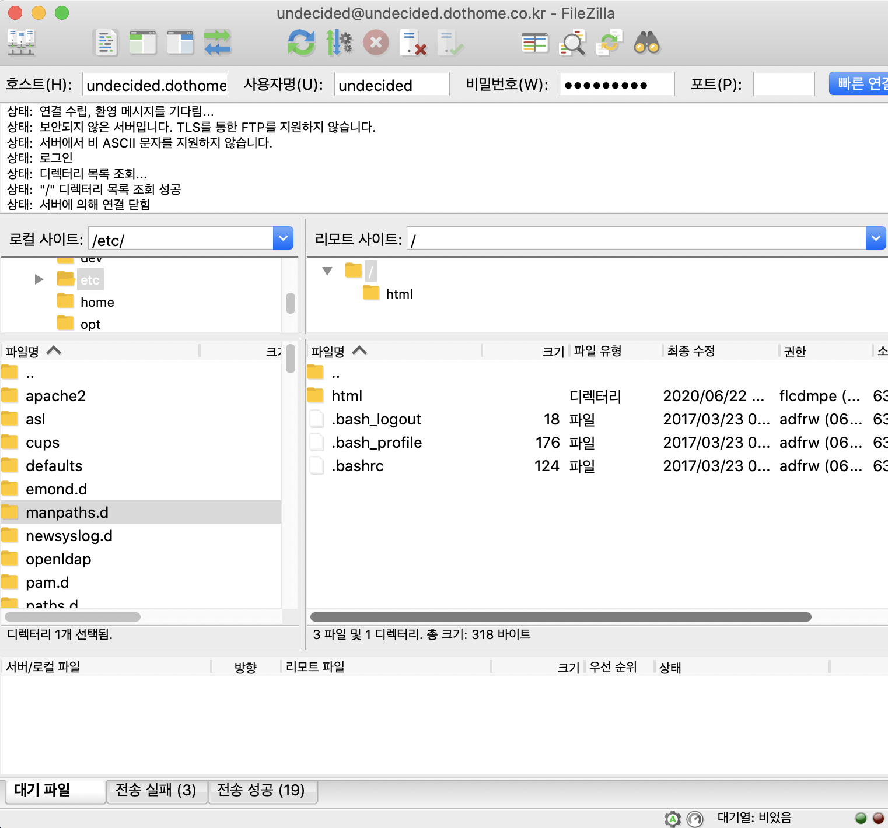
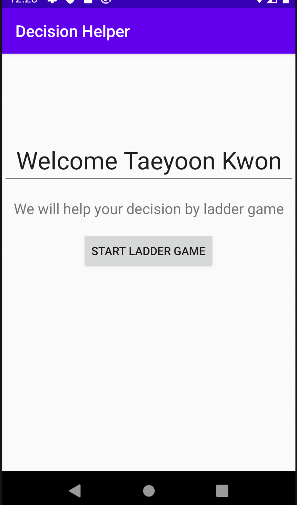
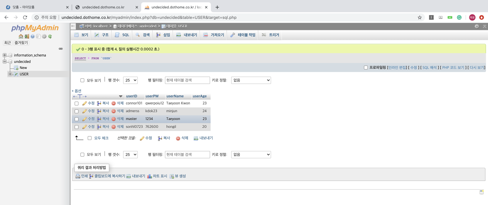
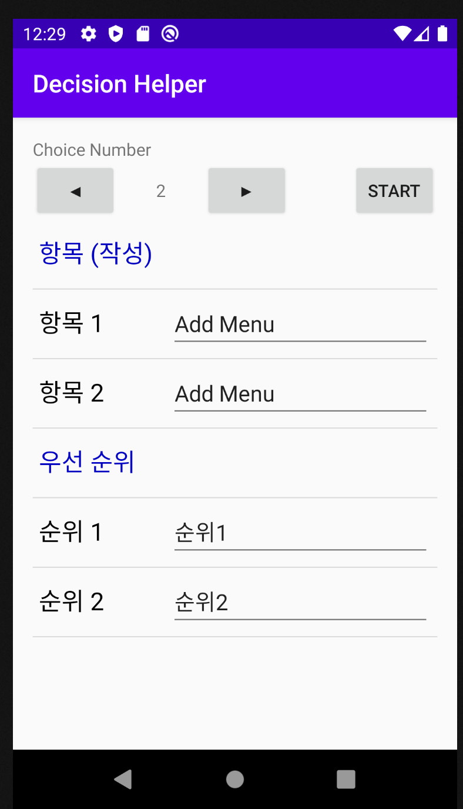
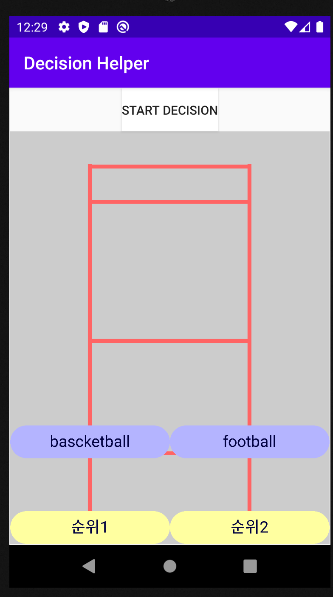
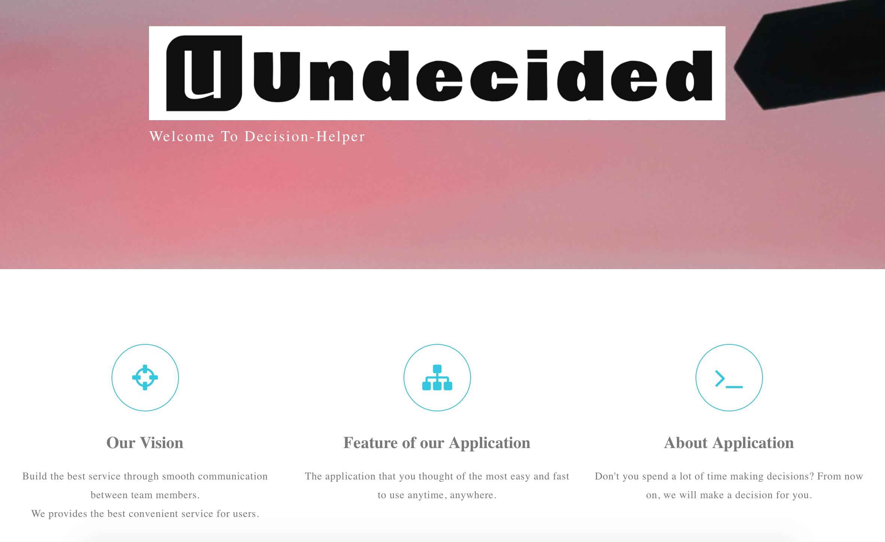

# Presentation #

기말평가에 대한 발표 자료

## Summary ##
- [협력](#협력)
- [개발(app)](#개발(app))
- [개발(web)](#개발(web))

### 협력 ###
- 소통
> by slack and [google docs](https://docs.google.com/document/d/1kHmPFcuxkHlAmARtdfunLj__AHHwikMT09TdQ3wyzNU/edit)
- 코드리뷰, 이슈
> Project 사용
>> [Organization Project](https://github.com/orgs/Hanyang-Erica-Oss-dev-2020-Undecided/projects)
>>
>> [App repository Project](https://github.com/Hanyang-Erica-Oss-dev-2020-Undecided/Decision-Helper/projects)
>>
>> [Web repository Project](https://github.com/Hanyang-Erica-Oss-dev-2020-Undecided/DecisionHelper_Webpage/projects)

> Issue & Milestone
>> [App repository Issue](https://github.com/Hanyang-Erica-Oss-dev-2020-Undecided/Decision-Helper/issues)
>>
>>[Webpage repository Issue](https://github.com/Hanyang-Erica-Oss-dev-2020-Undecided/DecisionHelper_Webpage/issues)

### 개발(app) ###
- 프로젝트 소개
> 평상시 결정을 못하고 있는 경우를 도와 줄 사다리 게임

- 팀 repository
> [app repository](https://github.com/Hanyang-Erica-Oss-dev-2020-Undecided/Decision-Helper)
- 3 Tier 구조
> Front-end
> Back-end
> DB

 

 

<<<<<<< HEAD
 
=======
 
>>>>>>> d9ffab93c9b87a918e96a0cfac20dae8c334b023

### 개발(web) ###
- Visit Webpage

- 프로젝트 멤버 소개
>권태윤, 손홍일, 이민재, 박민응, 강민준
>> github repository (click for checkout)
>>
>>[권태윤](https://github.com/Connoriginal), [손홍일](https://github.com/sonhl0723), [이민재](https://github.com/sochubert/oss2020), [박민응](https://github.com/sochubert/oss2020), [강민준](https://github.com/Min-Jun-Kang/minjun)
- 프로젝트 repository
> [Organization repository](https://github.com/Hanyang-Erica-Oss-dev-2020-Undecided)
>
> [App project repository](https://github.com/Hanyang-Erica-Oss-dev-2020-Undecided/Decision-Helper)
>
> [Webpage project repository](https://github.com/Hanyang-Erica-Oss-dev-2020-Undecided/DecisionHelper_Webpage)

- 문서화 부분
> checkout our [website](https://hanyang-erica-oss-dev-2020-undecided.github.io/DecisionHelper_Webpage/theme/index.html) or [github repository](https://github.com/Hanyang-Erica-Oss-dev-2020-Undecided/Decision-Helper)
